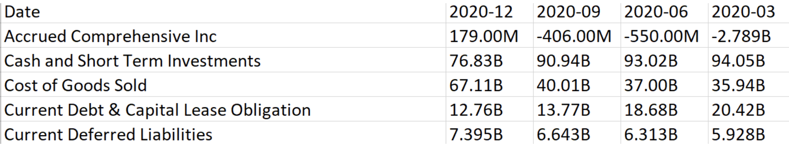
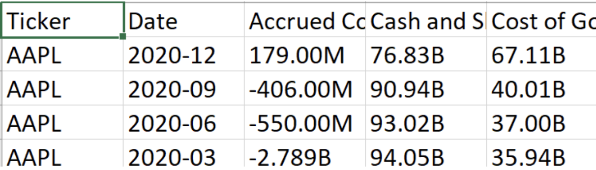
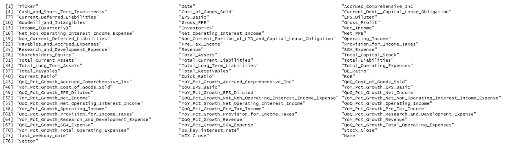

# Executive Summary 
abc
## Goal of the study
abc
## Data
## Findings

# Data Preperation 

## Data scraping

## Data processing 

Through scraping the data, we created 481 files of this format (not all rows/columns shown):


While this contained most of the data we needed, it was not structured properly for the analysis we wanted to do. We required a stock ticker column so that each file could be joined with separate industry sector and stock price tables. The data also needed to be transposed to create quarter-over-quarter and year-over-year change calculations for each of the metrics included in the table. We were unable to figure out how to do both simultaneously, so we manually adjusted each of the 481 files in Excel to have the following format:




The next step was to load all 481 files, merge them into a single data frame, and clean up the column names.

The rest of the data preparation and cleansing steps were as follows:
Change strings (40.08M) to numbers (40,000,080)
Create tables for industry, US key interest rate, stock price, and VIX and join to original data frame
Create new variables to reflect change in % quarter-over-quarter and year-over-year for all metrics
Create new variables that calculate important financial ratios and valuation figures
The resulting data frame had these 76 columns:




Stock price is the dependent variable in this analysis. We included US key interest rate, VIX, and quarter-over-quarter and year-over-year metrics as potential independent variables for our model. Our next step was to determine which ones were significant.


```{r Setup, include=FALSE, echo=FALSE, results='hide', warning=FALSE}
knitr::opts_chunk$set(echo = T, fig.width=8, fig.height=4)
options(scipen = 0, digits = 3)  # controls base R output

# Package setup
if(!require("pacman")) install.packages("pacman")

# add packages if needed
pacman::p_load(tidyverse, dplyr, ggplot2, data.table, lubridate, glmnet, car, zoo, quantmod, BIS, tidyquant, plotly, timetk, VIM, tree, rpart, randomForest, ranger, rattle, pROC, partykit, glmnet, lda, data.table, ISLR, gridExtra, ggrepel, leaps, car, tidyverse, contrast, sandwich, stargazer)
```
We first combine lists into single dataframe and clean dataframe.
```{r read data,echo=FALSE, results='hide', message=FALSE, warning=FALSE}
filenames <- list.files(pattern = "*.csv")
data_list <- lapply(filenames,fread)
data <- rbindlist(data_list, fill = TRUE)

Filter(function(x)!all(is.na(x)), data)
data <- data[, -c(39:58)]

data = filter(data, grepl("2",Date))

data$Date <- as.yearmon(data$Date)

names(data) <- gsub(" ", "_", names(data))

names(data) <- gsub("-", "_", names(data))

names(data) <- gsub("&", "", names(data))

data = subset(data, select=-c(Symbol,Name,Sector))
```
We then converted billions/millions/thousands into actual numbers.
```{r convert numbers,echo=FALSE, results='hide', message=FALSE, warning=FALSE}
combined_table2 <- data %>% mutate( across( c(3:38),
                     ~ case_when(
                         str_detect(., 'B') ~ parse_number(as.character(.), na = c("", "NA")) * 1e9,
                         str_detect(., 'M') ~ parse_number(as.character(.), na = c("", "NA")) * 1e6,
                         str_detect(., 'K') ~ parse_number(as.character(.), na = c("", "NA")) * 1e3,
                         TRUE ~ parse_number(as.character(.), na = c("", "NA"), trim_ws = TRUE)
                     )
                     ))
```
We also calculated the % changes over time of everything on IS and useful financial ratios as additional column measures.
```{r changes over time,echo=FALSE, results='hide', message=FALSE, warning=FALSE}
full_report <- combined_table2 %>%
  mutate(
    DE_Ratio = Total_Liabilities / Shareholders_Equity,
    Current_Ratio = Total_Current_Assets/Total_Current_Liabilities,
    Quick_Ratio = (Total_Current_Assets - Inventories)/Total_Current_Liabilities,
    RoE = Net_Income/Shareholders_Equity,
    QoQ_Pct_Growth_Accrued_Comprehensive_Inc = (Accrued_Comprehensive_Inc - lag(Accrued_Comprehensive_Inc))/lag(Accrued_Comprehensive_Inc),
    YoY_Pct_Growth_Accrued_Comprehensive_Inc = (Accrued_Comprehensive_Inc - lag(Accrued_Comprehensive_Inc, 4))/lag(Accrued_Comprehensive_Inc, 4),
    QoQ_Cost_of_Goods_Sold = (Cost_of_Goods_Sold - lag(Cost_of_Goods_Sold))/lag(Cost_of_Goods_Sold),
    YoY_Pct_Growth_Cost_of_Goods_Sold = (Cost_of_Goods_Sold - lag(Cost_of_Goods_Sold, 4))/lag(Cost_of_Goods_Sold, 4),
    QoQ_EPS_Basic = (EPS_Basic - lag(EPS_Basic))/lag(EPS_Basic),
    YoY_Pct_Growth_EPS_Basic = (EPS_Basic - lag(EPS_Basic, 4))/lag(EPS_Basic, 4),
    QoQ_Pct_Growth_EPS_Diluted = (EPS_Diluted - lag(EPS_Diluted))/lag(EPS_Diluted),
    YoY_Pct_Growth_EPS_Diluted = (EPS_Diluted - lag(EPS_Diluted, 4))/lag(EPS_Diluted, 4),
    QoQ_Pct_Growth_Net_Income = (Net_Income - lag(Net_Income))/lag(Net_Income),
    YoY_Pct_Growth_Net_Income = (Net_Income - lag(Net_Income, 4))/lag(Net_Income, 4),
    QoQ_Pct_Growth_Net_Non_Operating_Interest_Income_Expense = (Net_Non_Operating_Interest_Income_Expense - lag(Net_Non_Operating_Interest_Income_Expense))/lag(Net_Non_Operating_Interest_Income_Expense),
    YoY_Pct_Growth_Net_Non_Operating_Interest_Income_Expense = (Net_Non_Operating_Interest_Income_Expense - lag(Net_Non_Operating_Interest_Income_Expense, 4))/lag(Net_Non_Operating_Interest_Income_Expense, 4),
    QoQ_Pct_Growth_Net_Operating_Interest_Income = (Net_Operating_Interest_Income - lag(Net_Operating_Interest_Income))/lag(Net_Operating_Interest_Income),
    YoY_Pct_Growth_Net_Operating_Interest_Income = (Net_Operating_Interest_Income - lag(Net_Operating_Interest_Income, 4))/lag(Net_Operating_Interest_Income, 4),
    QoQ_Pct_Growth_Operating_Income = (Operating_Income - lag(Operating_Income))/lag(Operating_Income),
    YoY_Pct_Growth_Operating_Income = (Operating_Income - lag(Operating_Income, 4))/lag(Operating_Income, 4),
    QoQ_Pct_Growth_Pre_Tax_Income = (Pre_Tax_Income - lag(Pre_Tax_Income))/lag(Pre_Tax_Income),
    YoY_Pct_Growth_Pre_Tax_Income = (Pre_Tax_Income - lag(Pre_Tax_Income, 4))/lag(Pre_Tax_Income, 4),
    QoQ_Pct_Growth_Provision_for_Income_Taxes = (Provision_for_Income_Taxes - lag(Provision_for_Income_Taxes))/lag(Provision_for_Income_Taxes),
    YoY_Pct_Growth_Provision_for_Income_Taxes = (Provision_for_Income_Taxes - lag(Provision_for_Income_Taxes, 4))/lag(Provision_for_Income_Taxes, 4),
    QoQ_Pct_Growth_Research_and_Development_Expense = (Research_and_Development_Expense - lag(Research_and_Development_Expense))/lag(Research_and_Development_Expense),
    YoY_Pct_Growth_Research_and_Development_Expense = (Research_and_Development_Expense - lag(Research_and_Development_Expense, 4))/lag(Research_and_Development_Expense, 4),
    QoQ_Pct_Growth_Revenue = (Revenue - lag(Revenue))/lag(Revenue),
    YoY_Pct_Growth_Revenue = (Revenue - lag(Revenue, 4))/lag(Revenue, 4),
    QoQ_Pct_Growth_SGA_Expense = (SGA_Expense - lag(SGA_Expense))/lag(SGA_Expense),
    YoY_Pct_Growth_SGA_Expense = (SGA_Expense - lag(SGA_Expense, 4))/lag(SGA_Expense, 4),
    QoQ_Pct_Growth_Total_Operating_Expenses = (Total_Operating_Expenses - lag(Total_Operating_Expenses))/lag(Total_Operating_Expenses),
    YoY_Pct_Growth_Total_Operating_Expenses = (Total_Operating_Expenses - lag(Total_Operating_Expenses, 4))/lag(Total_Operating_Expenses, 4)
  )
```
Since interest rates were important to measure as a driver of stock prices, we joined interest rates to table.
```{r interest rates,echo=FALSE, results='hide', message=FALSE, warning=FALSE}
datasets <- get_datasets()

interest_data <- get_bis(datasets$url[datasets$name == "Policy rates (monthly)"],quiet = TRUE)

interest_rates <- interest_data %>% 
  select(reference_area, date, obs_value) %>%
  filter(reference_area == "United States" & date >= 2011-01-01)

interest_rates$date <- as.yearmon(interest_rates$date)

names(interest_rates)[3] <- "US_key_interest_rate"

interest_rates<- interest_rates %>%
  select(date, US_key_interest_rate)

names(interest_rates)[1] <- "Date"

joined_interest_rates <- left_join(full_report, interest_rates, by = "Date")
```
We also joined VIX (a measure of volatility) and stock prices as response variable.
```{r stock prices,echo=FALSE, results='hide', message=FALSE, warning=FALSE}

tickers <- unique(data$Ticker)
# tickers <- c("A","AAL","AAP","AAPL")
sd <- as.Date("2011-01-01")
ed <- as.Date("2021-03-30")

stock_prices <- tq_get(tickers, 
       from = sd, 
       to = ed ) %>%
  select(symbol, date, close) %>% 
  arrange(symbol)

colnames(stock_prices)[1] <- "Ticker"
colnames(stock_prices)[2] <- "Date"
colnames(stock_prices)[3] <- "Stock_Close"

stock_prices$last_weekday_date <- ave( 
  stock_prices$Date, 
  months(stock_prices$Date), 
  year = year(stock_prices$Date),
  FUN = function(x) tail(x[ !(weekdays(x) %in% c("Saturday","Sunday")) ], 1) 
)

stock_prices <- stock_prices %>% 
  select(Ticker, Date, Stock_Close, last_weekday_date) %>%
  filter(Date == last_weekday_date)

stock_prices$Date <- as.yearmon(stock_prices$Date)

joined_stock <- left_join(joined_interest_rates, stock_prices, by=c("Ticker" = "Ticker", "Date" = "Date"))
```

```{r VIX,echo=FALSE, results='hide', message=FALSE, warning=FALSE}
VIX <- getSymbols("^VIX", src = "yahoo", from = "2011-01-01", to = "2020-12-31", auto.assign = FALSE)

VIX <- as.data.frame(as.matrix(VIX))

VIX <- cbind(date = rownames(VIX), VIX)
rownames(VIX) <- 1:nrow(VIX)

VIX$newdate <- as.Date(VIX$date)
VIX$VIX <- as.numeric(VIX$VIX.Open)
VIX$VIX.High <- as.numeric(VIX$VIX.High)
VIX$VIX.Low <- as.numeric(VIX$VIX.Low)
VIX$VIX.Close <- as.numeric(VIX$VIX.Close)
VIX$VIX.Volume <- as.numeric(VIX$VIX.Volume)
VIX$VIX.Adjusted <- as.numeric(VIX$VIX.Adjusted)

VIX$last_weekday_date <- ave( 
  VIX$newdate, 
  months(VIX$newdate), 
  year = year(VIX$newdate),
  FUN = function(x) tail(x[ !(weekdays(x) %in% c("Saturday","Sunday")) ], 1) 
)

VIX$date <- as.yearmon(VIX$date)

colnames(VIX)[1] <- "Date"

VIX <- VIX %>% 
  select(Date, VIX.Close, newdate, last_weekday_date) %>%
  filter(newdate == last_weekday_date)

VIX <- VIX[,-3:-4] 

joined_stock_VIX <- left_join(joined_stock, VIX, by = "Date")
```

joining file with industry of companies
```{r company sector,echo=FALSE, results='hide', message=FALSE, warning=FALSE}
ind <- data.table::fread("SP500_2017.csv")
joined_stock_VIX_ind <- left_join(joined_stock_VIX, ind, by=c("Ticker" = "Symbol"))
```
calculating change in interest rate, stock price, and VIX
```{r join stock and VIX to original table,echo=FALSE, results='hide', message=FALSE, warning=FALSE}
final_full_report <- joined_stock_VIX_ind %>%
  mutate(
    QoQ_Pct_Growth_US_key_interest_rate = (US_key_interest_rate - lag(US_key_interest_rate))/lag(US_key_interest_rate),
    YoY_Pct_Growth_US_key_interest_rate = (US_key_interest_rate - lag(US_key_interest_rate, 4))/lag(US_key_interest_rate, 4),
    QoQ_Pct_Growth_Stock_Price = (Stock_Close - lag(Stock_Close))/lag(Stock_Close),
    YoY_Pct_Growth_Stock_Price = (Stock_Close - lag(Stock_Close, 4))/lag(Stock_Close, 4),
    QoQ_Pct_Growth_VIX = (VIX.Close - lag(VIX.Close))/lag(VIX.Close),
    YoY_Pct_Growth_VIX = (VIX.Close - lag(VIX.Close, 4))/lag(VIX.Close, 4),
)

```

## Note on Predictor Variable - stock price changes
Our response variable is the change in stock price from one quarter to the next. Therefore, our predictor variables will all reflect changes in items on the income statement on a quarter by quarter basis. However, some businesses are inherently cyclical. For example, we expect there to always be an increase in revenue from the fall to winter quarter for a christmas holiday store. Therefore, to assess if the business is doing better overall, we compare the winter quarter in 2020 to the winter quarter in 2019. Consequentally, we also included all YoY growth for every income line. We also included QoQ change in the volatility index, since that reflects global issues like COVID-19, and the QoQ change of interest rates since debt is dependent on it. 


# Exploratory Data Analysis

As discussed above, our data set includes information on the S&P 500 companies from stock price to income statement and balance sheet line items, as well as VIX and interest rates, spanning a ten-year period. 

A quick look at the data tells us that we have 19,155 rows of unique visits with 82 columns.

Unfortunately, because of inaccuracy in the data scrape and consequently inaccuracy in the calculated column values, we see a large number of missing values - 93,268. The NAs are spread across many different columns. Due to lack of time in rescraping, cleaning the data and troubleshooting the missing values, we decided to remove all NAs completely. This reduced the size of the data set by 5x to about 3.760 rows and 82 columns.

Additionally, we plotted out the Y variable, stock price change. What we saw were 2 outlier data points, which we discovered were Amazon and Google. Though we surmised that this could have been the result of "once-in-a-lifetime" events such as massive stock splits, acquisitions or even just trading errors, we left them in the data because these were also events that were highly correlated for stock price movements, and so we would want to model them out even if the sample size for those events were small.
``` {r basic data exploration}
dim(final_full_report)
names(final_full_report)
head(final_full_report)
# str(final_full_report)
# summary(final_full_report)
# unique(final_full_report$Ticker)

sum(is.na(final_full_report))
sum(!complete.cases(final_full_report))
# sapply(final_full_report, function(x) any(is.na(x)))

final_full_report2 <- na.omit(final_full_report)
dim(final_full_report2)
plot(final_full_report2$QoQ_Pct_Growth_Stock_Price)

final_full_report2[QoQ_Pct_Growth_Stock_Price > 60]
```
# Modelling

For the modelling, we only used the predictor variables mentioned before and removed all other columms. We one hot encoded sector to include it in our analysis.
```{r}
final_full_report2 = final_full_report2 %>% mutate(value = 1)  %>% spread(Sector, value,  fill = 0 ) 
final_full_report2 = final_full_report2[,c(43:70,77:91)]
```

## LASSO - Quarterly Analysis

For our model analysis, we will be using LASSO followed by backward elimination.

### Data preparation

We first wanted to test quarter on quarter changes and effects, and so isolated columns that were Quarter on quarter (QoQ) based.

We then split our data into training and validation data so that we can evaluate final model in an unbiased manner. Since we are using LASSO, we do not need to further split into training+testing as the cross validation in LASSO function handles the testing for us.

Lastly, to eliminate downstream errors with cv.glmnet, we also removed all Inf values from the dataset.

```{r data preparation,echo=FALSE, message=FALSE, warning=FALSE, results='hide'}

# Column removal
cols <- grep("QoQ*", colnames(final_full_report2))
data_lasso_q <- final_full_report2[,..cols]

# Split the data into training and validation
set.seed(1)
N <- nrow(data_lasso_q)
n1 <- floor(.823*N) # 82.3% on training, based on StackOverflow; no need testing data as we are using LASSO for model selection

idx_train <- sample(N, n1)
idx_val <- (which(! seq(1:N) %in% idx_train))

data.train.q <- data_lasso_q[idx_train,]
data.val.q <- data_lasso_q[idx_val,]

# Remove Inf values from dataset
data.train.q2 <- data.train.q[is.finite(rowSums(as.matrix(data.train.q))),]
```

### LASSO - Quarterly Stock Price Changes

We then conducted a Gaussian LASSO on the training data to find a parsimonious model.

``` {r LASSO - quarterly,echo=FALSE, message=FALSE, warning=FALSE}
set.seed(1)
X <- model.matrix(QoQ_Pct_Growth_Stock_Price~.,data=data.train.q2)[,-1]
Y <- as.matrix(data.train.q2[,"QoQ_Pct_Growth_Stock_Price"])

set.seed(1)
data.cv.q <- cv.glmnet(X, Y, alpha=1, nfolds=10)
plot(data.cv.q$lambda) # Visualize # and values of lambdas
plot(data.cv.q) # Visualize LASSO spread

# Extract coefficients and names
coef.1se <- coef(data.cv.q, s="lambda.1se")
coef.1se <- coef.1se[which(coef.1se !=0),]
var.1se <- rownames(as.matrix(coef.1se))[-1]

# Feed coefficients into LM to get Relaxed LASSO
lm.input <- as.formula(paste("QoQ_Pct_Growth_Stock_Price", "~", paste(var.1se, collapse = "+")))
fit.1se.lm <- lm(lm.input, data=data.train.q2) 
summary(fit.1se.lm)
Anova(fit.1se.lm)
```
We see that LASSO yields 3 variables - COGs, R&D expense and VIX as variables that are statistically significant in driving stock price. Since these are all below the 0.05 p-value threshold, we do not need to engage in backward elimination to remove any of the variables.

Additionally, the F-stat indicates that the overall model is statistically significant. The R-squared is unusually high as well indicating a tight fit. However, the intercept is not statistically significant, indicating that if all other change variables are zero, there is not enough evidence to suggest that the stock price change would be zero.

The big red flag on this output is that based on knowledge of the subject matter, we believe the model is highly flawed, as it does not incorporate some major variables of stock price changes, namely operating income, revenue and EPS which are all revenue-based measures and are indicators that investors look towards closely. There are a number of other reasons why the model may be flawed (again based on practitioner knowledge) that we will discuss under Key Takeaways for the LASSO section.

### Model diagnosis

To see improvements to the LASSO model, we first conduct a quick model analysis.

We can see that the residuals actually clustered to one side, indicating that the model may have major  linearity gaps. In particular, there are some outliers (perhaps the Google/Amazon outliers we saw earlier) that could be driving the clustering in the residual plots.

We see that the observations are not evenly distributed across band at all, and so does not fulfill the homoscedasticity requirement.

In terms of normality, we see that the ends diverge quite severely from the straight line, indicating divergence at the tails.
``` {R improvements to model}
par(mfrow=c(1,2))
plot(fit.1se.lm.reduced2, 1)
plot(fit.1se.lm.reduced2, 2)
```

### LASSO - Yearly Stock Price Changes

We do the exact same analysis as above but for yearly change measures to see if the model yields better results.

``` {r LASSO - yearly}

# Column removal
cols.y <- grep("YoY*", colnames(final_full_report2))
data_lasso_y <- final_full_report2[,..cols.y]

# Split the data into training and validation
set.seed(1)
N.y <- nrow(data_lasso_y)
n1.y <- floor(.823*N.y) # 82.3% on training, based on StackOverflow; no need testing data as we are using LASSO for model selection

set.seed(1)
idx_train.y <- sample(N.y, n1.y)
idx_val.y <- (which(! seq(1:N.y) %in% idx_train.y))

data.train.y <- data_lasso_y[idx_train.y,]
data.val.y <- data_lasso_y[idx_val.y,]

# Remove Inf values from dataset
data.train.y2 <- data.train.y[is.finite(rowSums(as.matrix(data.train.y))),]

set.seed(1)
X.y <- model.matrix(YoY_Pct_Growth_Stock_Price~.,data=data.train.y2)[,-1]
Y.y <- as.matrix(data.train.y2[,"YoY_Pct_Growth_Stock_Price"])

set.seed(1)
data.cv.y <- cv.glmnet(X.y, Y.y, alpha=1, nfolds=10)
plot(data.cv.y$lambda) # Visualize # and values of lambdas
plot(data.cv.y) # Visualize LASSO spread

# Extract coefficients and names
coef.1se.y <- coef(data.cv.y, s="lambda.1se")
coef.1se.y <- coef.1se.y[which(coef.1se.y !=0),]
var.1se.y <- rownames(as.matrix(coef.1se.y))[-1]

# Feed coefficients into LM to get Relaxed LASSO
lm.input.y <- as.formula(paste("YoY_Pct_Growth_Stock_Price", "~", paste(var.1se.y, collapse = "+")))
fit.1se.lm.y <- lm(lm.input.y, data=data.train.y2) 
summary(fit.1se.lm.y)
Anova(fit.1se.lm.y)
```

As you can see, this model runs into the same flaws, with only R&D expense being a key variable and everything else ommitted. This again flies in the face of what we know is true in the investing world and so indicates that the model and even data may be flawed.

### Key Takeaways

We conclude that the model is largely flawed due to the diagnoses of the models, as well as from fundamental knowledge of investing, where investors look closely at revenue and operating income as key indicators of business valuation. Even though certain metrics of the model were robust, others indicate that the model may be nonsensical and are omitting many other variables.

There are a number of next steps to further improve this LASSO model:
- The data gaps could be ironed out and the missing data could be added to the dataset
- We could have looked into and removed the outliers if they were truly one-time events that may not deal with the "fundamentals" of the business (i.e. what's on the income statement and balance sheet)
- We could have taken stock price changes to be changes from a few days prior to earnings annoucnements rather than day-of, as we know from experience that stock prices change a little bit quicker than earnings calls
- We could have tried to account for other very salient key drivers of stock prices, including: market sentiment to the company, general peak/troughs of business cycle, the presence of bubbles and animal spirits, performance of company relative to analyst expectations (vs. absolute performance), and many other drivers


## Single Tree Using EBITDA
``` {r single tree, echo=FALSE, message=FALSE, warning=FALSE}
final_full_report3 = final_full_report2[QoQ_Pct_Growth_Operating_Income<30 & QoQ_Pct_Growth_Operating_Income>-30 ]

plot(final_full_report3$QoQ_Pct_Growth_Operating_Income, final_full_report3$QoQ_Pct_Growth_Stock_Price, pch=16, cex=1, col = "blue",
     xlab = "% change in EBITDA", 
     ylab = "% change in Stock Price")

fit.tree.single <- tree(QoQ_Pct_Growth_Stock_Price~QoQ_Pct_Growth_Operating_Income,final_full_report3) 
plot(fit.tree.single)
text(fit.tree.single)   
partition.tree(fit.tree.single, col="red", lwd=2)

points(final_full_report3$QoQ_Pct_Growth_Operating_Income, final_full_report3$QoQ_Pct_Growth_Stock_Price, pch=16, cex=.5)
```
``` {r single tree, echo=FALSE, message=FALSE, warning=FALSE}
 summary(fit.tree.single)
```

## Random Forest 
``` {r Random Forest, echo=FALSE, message=FALSE, warning=FALSE}

names(final_full_report2) = make.names(colnames(final_full_report2), unique = FALSE, allow_ = TRUE)

fit.rf <- randomForest(QoQ_Pct_Growth_Stock_Price~., final_full_report2, mtry=5, ntree=500)    # change ntree
plot(fit.rf, col="red", pch=16, type="p", 
     main="default plot")

```


